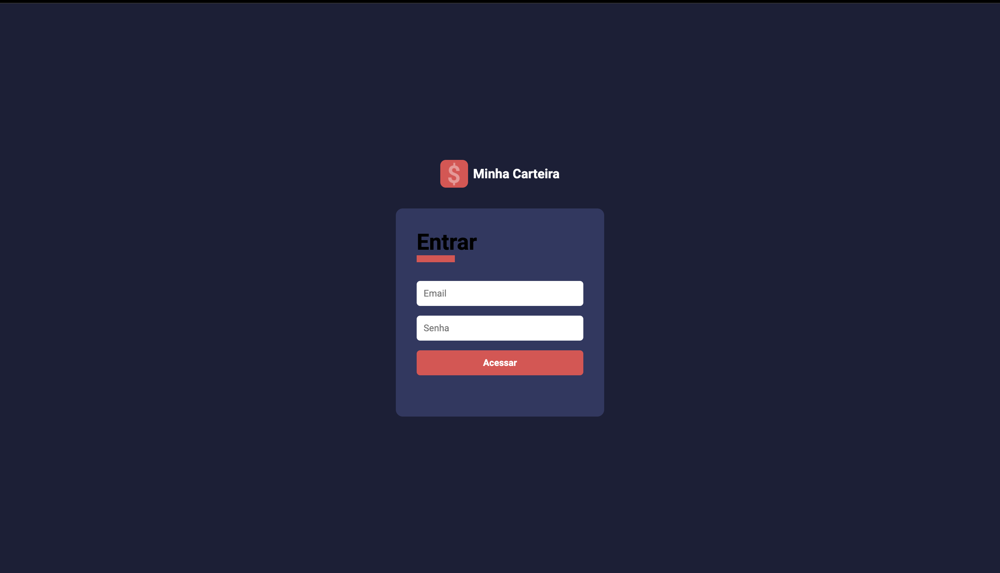
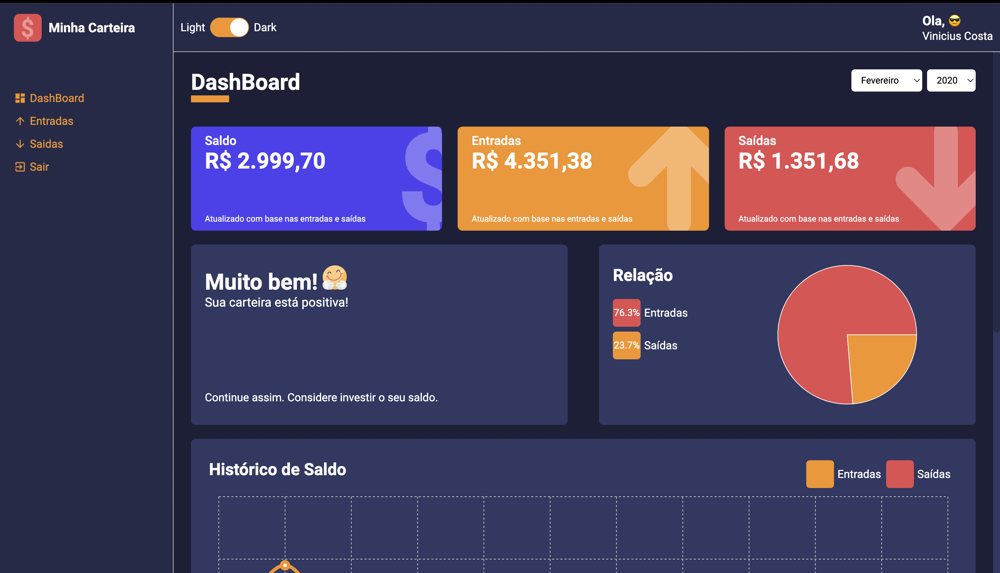
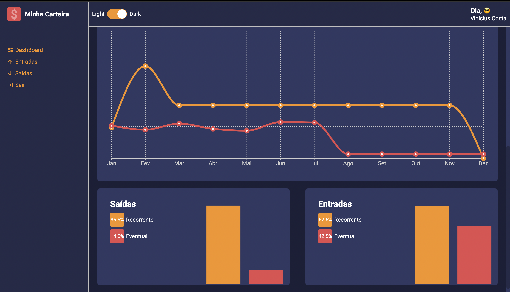
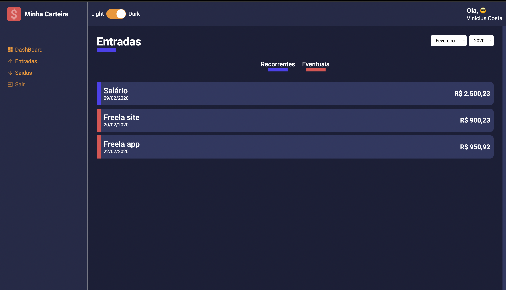
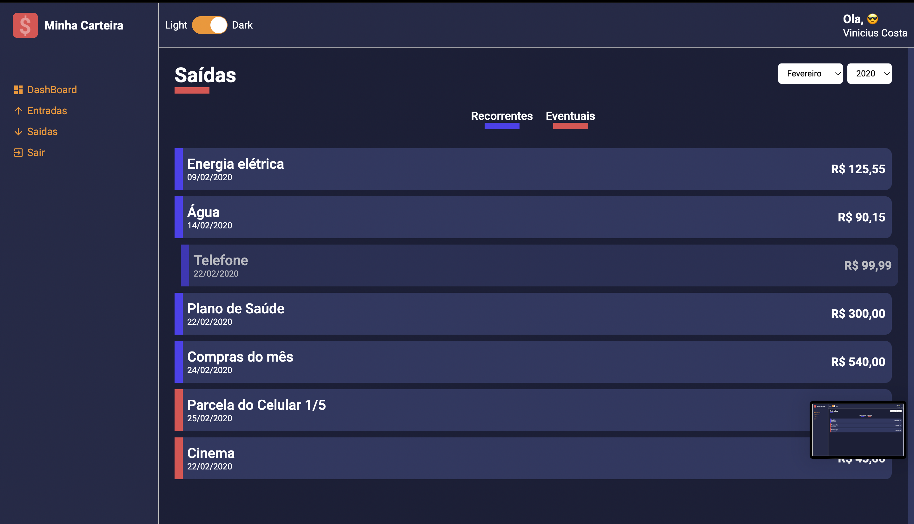

# minha-carteira

# 📸 Overview:








# 💻 Project:

# 🚀 Technologies:
### ✔️ ReactJS
### ✔️ TypeScript
### ✔️ Vite


# How to run

```
# Clone this repository
$ git clone https://github.com/vinnycosta9898/minha-carteira

# Go to the directory
$ cd minha-carteira

# Install Dependencies
$ npm install

# Run Web Server
$ npm run dev

#Login
email: teste@teste.com
password: 123123
